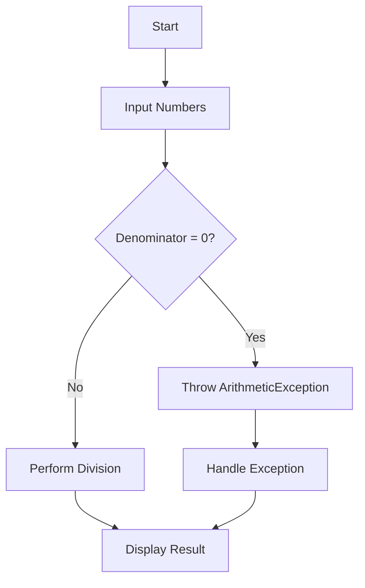

# Object-Oriented-Programming-I-CAT-2 Nshokano Mirindi Justin


## 🏗️ Architectural Overview

This codebase demonstrates **four fundamental OOP principles** through practical Java implementations:

1. **Encapsulation** - Data protection mechanism
2. **Polymorphism** - Through method overloading and overriding 
3. **Abstraction** - Using abstract classes
4. **Inheritance** - Class hierarchies and specialization

## 🔗 Logical Flow Breakdown

### 1. Encapsulation System (Student Class)

**Data Flow:**
```
External Request → Public Setter → Validation Check → Private Field Update
```

**Control Logic:**
```java
public void setGrade(int grade) {
    if (grade >= 0 && grade <= 100) {  // Guard clause
        this.grade = grade;            // Valid case
    } else {
        this.grade = 0;                // Fallback
    }
}
```

**Key Characteristics:**
- Input sanitization before state modification
- Immutable internal state except through controlled methods
- Fail-safe default values

### 2. Polymorphism Implementation

#### Method Overloading (Static Polymorphism)
**Compile-Time Resolution:**
```java
multiply(2, 3)      → binds to multiply(int, int)
multiply(2, 3, 4)   → binds to multiply(int, int, int)
```

**Type Signature Matrix:**
| Method | Parameters | Return Type |
|--------|------------|-------------|
| multiply | int, int | int |
| multiply | int, int, int | int |

#### Method Overriding (Dynamic Polymorphism)
**Runtime Dispatch Mechanism:**
1. JVM checks object's actual type
2. Looks for method in class hierarchy
3. Executes most specific implementation

**Virtual Method Table (Conceptual):**
| Class | makeSound() Entry Point |
|-------|-------------------------|
| Animal | Animal.makeSound() |
| Dog | Dog.makeSound() | 
| Cat | Cat.makeSound() |

### 3. Abstraction Framework

**Class Contract Enforcement:**
```java
abstract class Appliance {
    abstract void turnOn();  // Required contract
}

class TV extends Appliance {
    void turnOn() {         // Concrete fulfillment
        // TV-specific logic
    }
}
```

**Design Benefits:**
- Defines what must be done (interface)
- Allows how it's done (implementation)
- Enables future extensions

### 4. Exception Handling System

**Control Flow:**


**Error Recovery Strategy:**
1. Prevention: Input validation
2. Containment: Try-catch isolation
3. Recovery: Fallback messaging
4. Continuation: Graceful program flow

## 💡 Deep Design Insights

### Encapsulation Tradeoffs
- **Pros:** Data integrity, controlled access, validation
- **Cons:** Boilerplate code, slight performance overhead
- **Solution Pattern:** Lombok annotations in production code

### Polymorphism Performance
- Overloading: Zero runtime cost (compile-time)
- Overriding: Minimal vtable lookup overhead
- Optimization: `final` methods for devirtualization

### Abstraction Layers
1. Hardware: Abstract appliance concept
2. Middleware: Device-specific drivers
3. Application: Unified control interface

### Exception Handling Best Practices
- Specific exception types
- Resource cleanup in finally
- Contextual error messages
- Logging for diagnostics

## 🛠️ Production-Grade Recommendations

1. **Enhance Encapsulation:**
```java
// Thread-safe version
public synchronized void setGrade(int grade) {
    // Validation logic
}
```

2. **Improve Polymorphism:**
```java
// Interface alternative
interface SoundMaker {
    void makeSound();
}
```

3. **Strengthen Abstraction:**
```java
// Template method pattern
abstract class Appliance {
    final void powerOn() {  // Non-overridable
        checkVoltage();
        turnOn(); 
        logPowerEvent();
    }
    abstract void turnOn();
}
```

4. **Robust Exception Handling:**
```java
// Enhanced version
try {
    // Operation
} catch (ArithmeticException e) {
    logger.log(Level.WARNING, "Division error", e);
    throw new BusinessException("Calculation failed", e);
} finally {
    resources.close();
}
```
